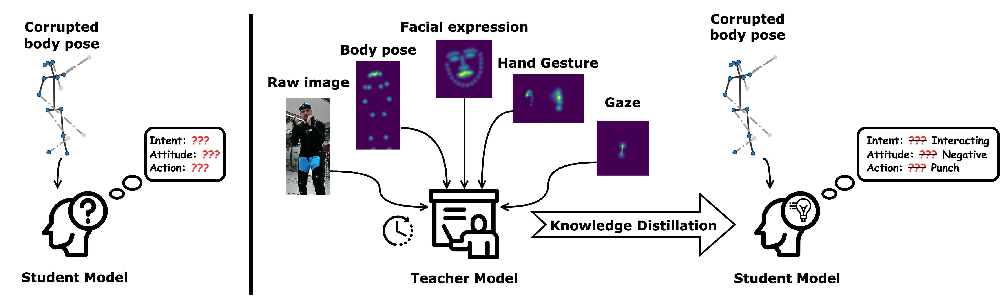
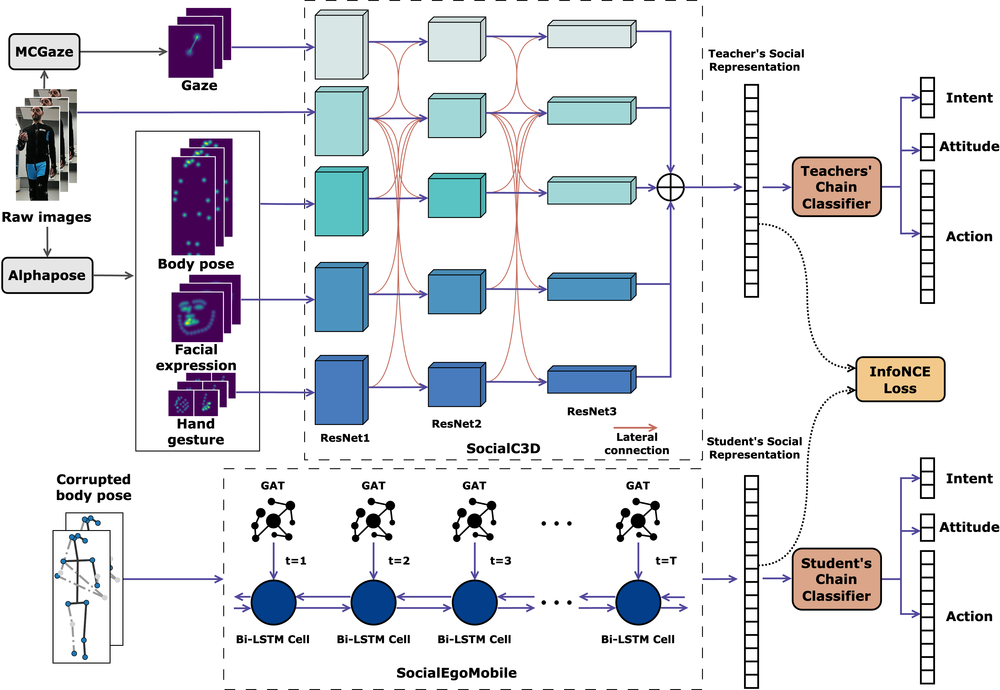
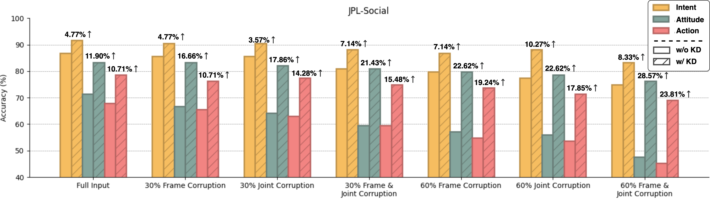
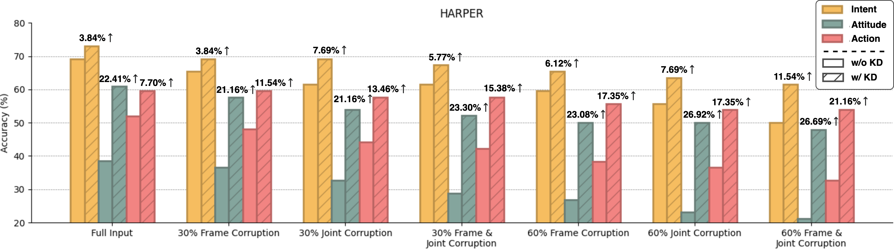

# SocialEgoMobile

This is the official repo for the paper:

[Robust Understanding of Human-Robot Social Interactions through Multimodal Distillation](https://arxiv.org/abs/2412.16698) [](https://arxiv.org/abs/2412.16698)

<div align="center">
    
</div>

Abstract:
The need for social robots and agents to interact and assist humans is growing steadily. To be able to successfully
interact with humans, they need to understand and analyse socially interactive scenes from their (robot's) perspective.
Works that model social situations between humans and agents are few; and even those existing ones are often too
computationally intensive to be suitable for deployment in real time or on real world scenarios with limited available
information. We propose a robust knowledge distillation framework that models social interactions through various
multimodal cues, yet is robust against incomplete and noisy information during inference. Our teacher model is trained
with multimodal input (body, face and hand gestures, gaze, raw images) that transfers knowledge to a student model that
relies solely on body pose. Extensive experiments on two publicly available human-robot interaction datasets demonstrate
that the our student model achieves an average accuracy gain of 14.75% over relevant baselines on multiple downstream
social understanding task even with up to 51% of its input being corrupted. The student model is highly efficient: it
is < 1% in size of the teacher model in terms of parameters and uses ~ 0.55‰ FLOPs of that in the teacher model.

<div align="center">
    
</div>

Our knowledge distillation framework uses SocialC3D as the teacher model, which fuses raw images, body, face, hand
gestures, and gaze. Each modality is processed by a ResNet [1] and integrated via lateral connections and late fusion,
producing a high-quality social representation for downstream tasks. The lightweight student model, SocialEgoMobile,
uses only corrupted body pose. It consists of a two-layer GAT [2] and a single-layer Bi-LSTM [3] to extract social
representations. The framework distillates knowledge from the teacher model by maximising the mutual information [4] of
the
social representations output by the teacher and student model. Whole body pose features were extracted
using [AlphaPose](https://github.com/MVIG-SJTU/AlphaPose) and gaze features were extracted
using [MCGaze](https://github.com/zgchen33/MCGaze).

## Result

###Performance

|                              | Params (M) | FLOPs (M) | Intent Acc. | Attitude Acc. | Action Acc. |
|------------------------------|------------|-----------|-------------|---------------|-------------|
| ST-GCN<sup>+</sup> [5]       | 42.86      | 1924.87   | 86.90       | 76.19         | 71.43       |
| ST-TR<sup>+</sup> [6]        | 58.48      | 4724.63   | 79.76       | 59.52         | 48.81       |
| MS-G3D<sup>+</sup> [7]       | 48.82      | 5241.97   | 88.10       | 80.95         | 76.19       |
| SocialEgoNet<sup>+</sup> [8] | 37.78      | 422.35    | 86.90       | 77.38         | 71.43       |
| **SocialEgoC3D (ours)**      | 48.49      | 7902.19   | **92.85**   | **88.10**     | **82.14**   |
| **SocialEgoMobile (ours)**   | **0.43**   | **4.23**  | 82.14       | 71.43         | 67.86       |

Table.1 Performance of [JPL-Social](https://github.com/biantongfei/SocialEgoNet)

|                              | Intent Acc. | Attitude Acc. | Action Acc. |
|------------------------------|-------------|---------------|-------------|
| ST-GCN<sup>+</sup> [5]       | 86.54       | 73.08         | 78.85       |
| ST-TR<sup>+</sup> [6]        | 75.00       | 65.38         | 59.61       |
| MS-G3D<sup>+</sup> [7]       | 90.38       | 78.85         | 80.77       |
| SocialEgoNet<sup>+</sup> [8] | 86.54       | 75.00         | 78.85       |
| **SocialEgoC3D (ours)**      | **96.15**   | **82.69**     | **88.46**   |
| **SocialEgoMobile (ours)**   | 69.23       | 44.23         | 52.19       |

Table.2 Performance on [HARPER](https://github.com/intelligolabs/HARPER)

Comparison of SocialC3D and SocialEgoMobile with state-of-the-art methods on
the [JPL-Social](https://github.com/biantongfei/SocialEgoNet) and [HARPER](https://github.com/intelligolabs/HARPER).
SocialEgoMobile relies solely on clean body pose features as input. '+' indicates that the model uses raw image and gaze
information. SocialEgoMobile only use body pose as input.

### Robustness Analysis

<div align="center">
    
</div>

<div align="center">
    
</div>

Knowledge distillation (KD) consistently improves the performance of the student model, SocialEgoMobile, under
Individual and simultaneous spatio-temporal corruption on all three downstream tasks, interaction intent, attitude, and
social action forecast. Improvements on downstream task accuracy through distillation are labelled.

## Data

The datasets used in this paper can be downloaded
here: [JPL-Social](https://drive.google.com/file/d/1gpH_T60e99cR_x4C5B2YKvPPa99rBzic/view?usp=drive_link) and HARPER. A
detailed description of the datasets can be found here: [JPL-Social](https://github.com/biantongfei/SocialEgoNet)
and [HARPER](https://github.com/intelligolabs/HARPER).

## Train and Test

To train and test SocialEgoNet on JPL-Social, you need download the data and save it under the current project path.

To train a new SocialEgoNet, run

```
python scripts/train.py --cfg config/train.yaml
```

To test the pretrained weights on JPL-Social, run

```
python scripts/test.py --cfg config/test.yaml --check_point weights/socialegonet_jpl.pt
```

## Citation

Please cite the following paper if you use this repository in your research.

```
@INPROCEEDINGS{bian2024interact,
  author={Bian, Tongfei and Ma, Yiming and Chollet, Mathieu and Sanchez, Victor and Guha, Tanaya},
  booktitle={2025 IEEE International Conference on Multimedia and Expo (ICME)}, 
  title={Interact with me: Joint Egocentric Forecasting of Intent to Interact, Attitude and Social Actions}, 
  year={2025}
}
```

## Refrences

```
[1] Kaiming He, Xiangyu Zhang, Shaoqing Ren, and Jian Sun. 2016. Deep residual learning for image recognition. In Proceedings of the IEEE conference on computer vision and pattern recognition. 770–778.
[2] Petar Veličković, Guillem Cucurull, Arantxa Casanova, Adriana Romero, Pietro Liò, and Yoshua Bengio. 2018. Graph Attention Networks. In International Conference on Learning Representations.
[3] Alex Graves and Jürgen Schmidhuber. 2005. Framewise phoneme classification with bidirectional LSTM networks. In Proceedings. 2005 IEEE International Joint Conference on Neural Networks, 2005., Vol. 4. IEEE, 2047–2052.
[4] Aaron van den Oord, Yazhe Li, and Oriol Vinyals. 2018. Representation learning with contrastive predictive coding. arXiv preprint arXiv:1807.03748 (2018).
[5] Sijie Yan, Yuanjun Xiong, and Dahua Lin. 2018. Spatial temporal graph convolutional networks for skeleton-based action recognition. In Proceedings of the AAAI conference on artificial intelligence, Vol. 32.
[6] Chiara Plizzari, Marco Cannici, and Matteo Matteucci. 2021. Spatial temporal transformer network for skeleton-based action recognition. In Pattern recognition. ICPR international workshops and challenges: virtual event, January 10–15, 2021, Proceedings, Part III. Springer, 694–701.
[7] Ziyu Liu, Hongwen Zhang, Zhenghao Chen, Zhiyong Wang, and Wanli Ouyang. 2020. Disentangling and unifying graph convolutions for skeleton-based action recognition. In Proceedings of the IEEE/CVF conference on computer vision and pattern recognition. 143–152.
[8] Tongfei Bian, Yiming Ma, Mathieu Chollet, Victor Sanchez, and Tanaya Guha. 2025. Interact with me: Joint Egocentric Forecasting of Intent to Interact, Attitude and Social Actions. In Proceedings of the IEEE International Conference on Multimedia and Expo (ICME).
```
